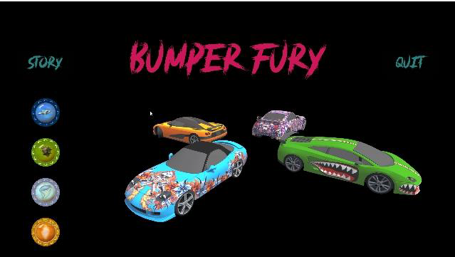
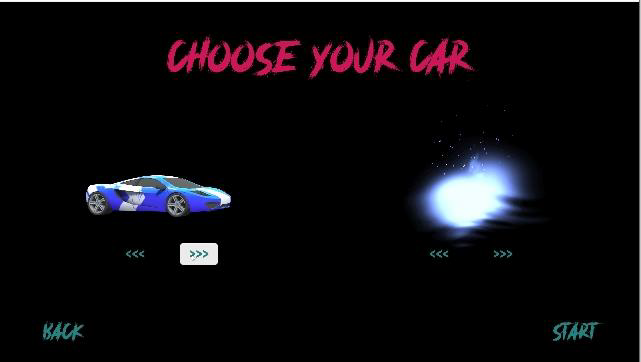
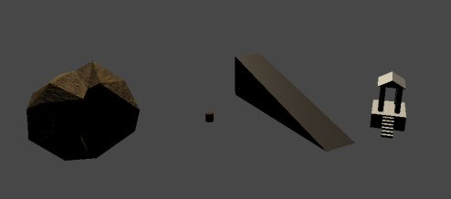
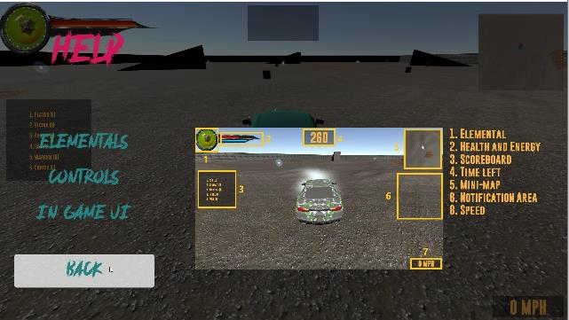
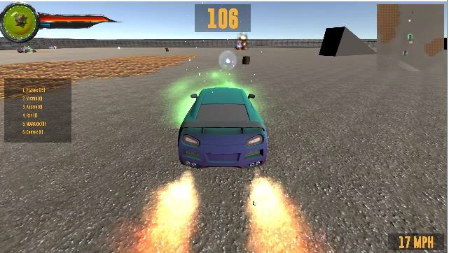
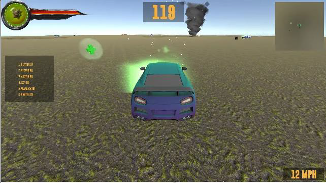
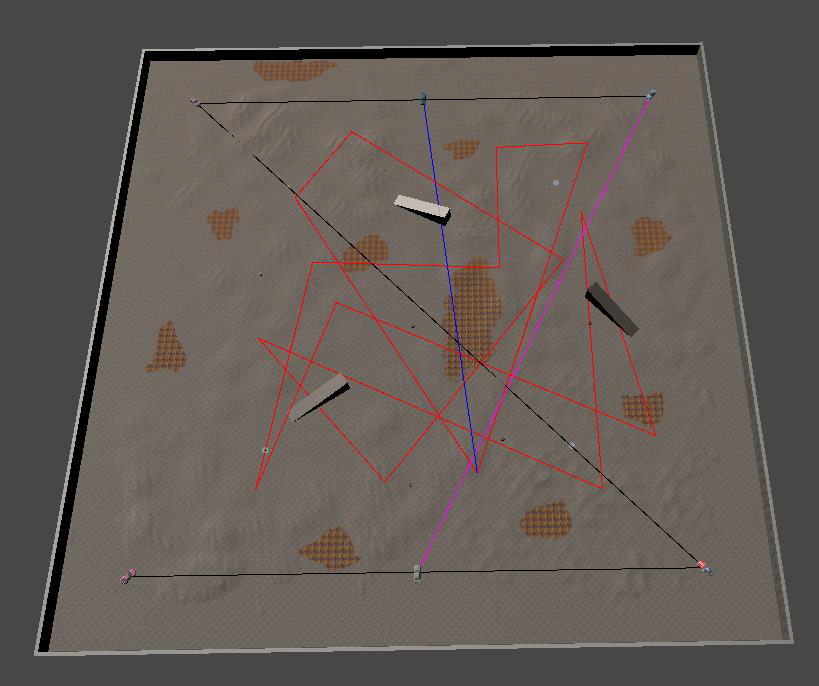
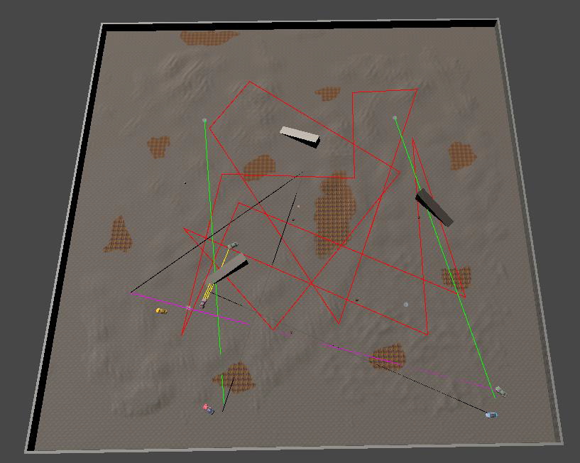

## BUMPER FURY

* Thanks [1001 Fonts](https://www.1001freefonts.com) for excellent fonts.
* Thanks [Open Game Art](https://opengameart.org/) and [Unity Assets Store](https://assetstore.unity.com/) for amazing assets.
* Thanks [Free Sound Effects](https://www.freesoundeffects.com), [Zapsplat](https://www.zapsplat.com/), and [Sound Bible](http://soundbible.com/) for stunning sounds.

Thanks to the creators of following videos for excellent tutorials:
* Android migration - https://www.youtube.com/watch?v=CcsUFGfdO_0
* Car Wheels - https://www.youtube.com/watch?v=mnAEeE3FcvA
* Car AI - https://www.youtube.com/watch?v=o1XOUkYUDZU&list=PLB9LefPJI-5wH5VdLFPkWfnPjeI6OSys1
* Game Audio - https://www.youtube.com/watch?v=6OT43pvUyfY
* Pause Menu - https://www.youtube.com/watch?v=JivuXdrIHK0

## Theme and Narrative

The story is based on a world where humans have gained control over basic elements of nature: Fire, Earth, Water, and Air, and able to harness their power inside Adamantium crystals. They invented a game where traditional bumper cars are powered up by those. The player is the son of a legend in this sport and just crossed the legal age to participate in a local tournament. You start with choosing a car and an elemental. The later decides the type of projectile you can shoot. A level is created for each of the elements from scratch using Unity’s Terrain Builder. Some custom models are created using Unity’s Pro-builder. The blood splatter (for damage indication) screen is developed using GIMP. The game has apt audio responses and upbeat background music.

**Title Screen**

**Car Selection Screen**

**Custom 3D Models using Pro-builder**

### Physics

Cars are powered by Unity’s wheel colliders and Newtonian’s physics is provided by Unity’s rigid body. Some of the game physics is implemented using C# scripts for various scenarios such as to produce projectile impact, car push-back while firing, environmental effects such as rock shower, tornadoes, and dust storm, barrel explosions, etc. A set of experiments done for various physics elements are presented in the last part of the report. The collision impact is estimated based on relative velocity and damage, energy gain, and score gain is set accordingly.

### AI/Game

The game has a third-person view and is equipped with a main menu and pause menu with options for help and quit. In-game UI has different elements such as a score-board, level timer, player HUD, mini-map, and speedometer. The mini-map is implemented using an orthographic camera on the top following the player. A level has three types of items to collect – Health, Speed boost, Energy, that are spawned at regular intervals. Each level features unique traps such as Lava, Water, Tornados, Rock shower, Dust storm, and Explosive Barrels. Game difficulty is implemented using health buffs/reductions, energy multipliers, level timings, and making AI more intelligent and/or aggressive.

**Help Menu**

**In Game Screen - Fire Level**

**In Game Screen - Water Level**

AI opponents travel the map guided by a set of invisible waypoints. AI decides to attack the player/other AI in a stochastic way. Other abilities include detecting car flipping, reversing, detecting level boundaries, looking for items on the map, etc. A set of five sensors are implemented on the AI to make it sense the surrounding environment. Three of them are at the front and two in angled positions on both sides. The AI can detect obstacles such as Rocks, Ramps, and Barrels, and environments such as Lava and Storm. After detecting other opponents, it can fire projectiles at them.

**Waypoint Graphs for AI**

### Devices and AI

The game can be built for Android devices. On Android, the car is controlled by the device’s accelerometer and the player fires the projectile by touching the car on the screen. Two UI buttons are implemented to reset the car and to apply handbrakes. For accessibility, the player can enable virtual D-pad disabling accelerometer input. A different help screen is implemented for android devices.

